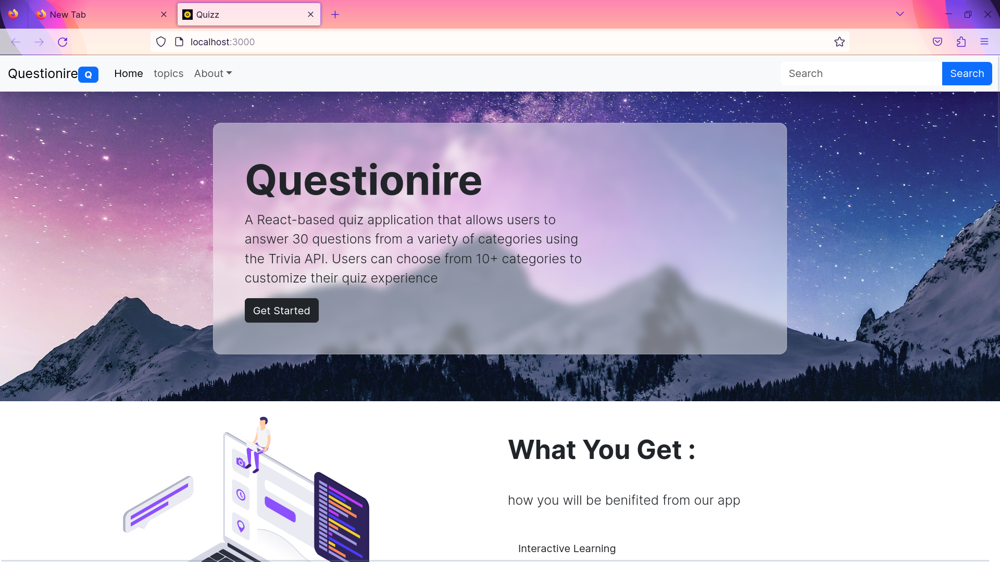
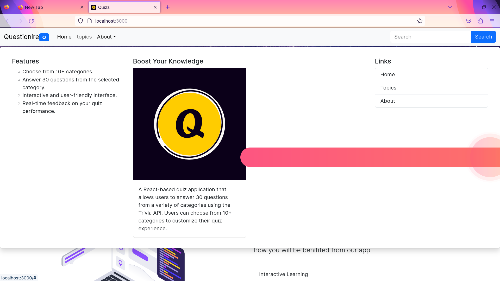
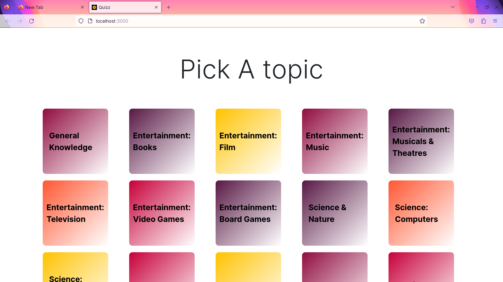
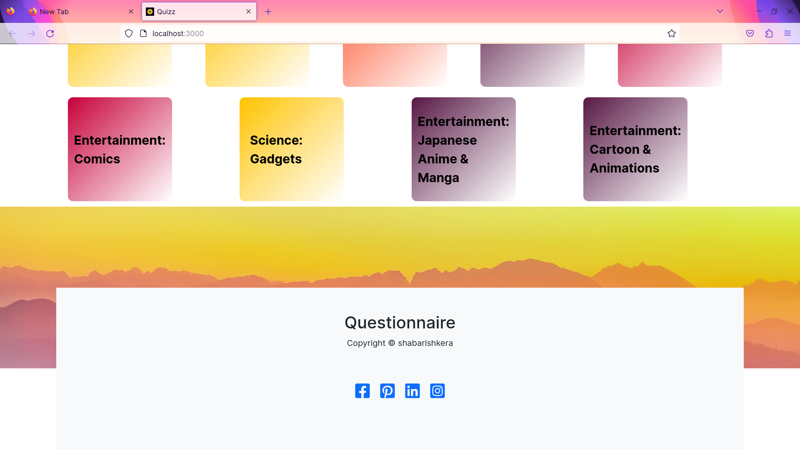
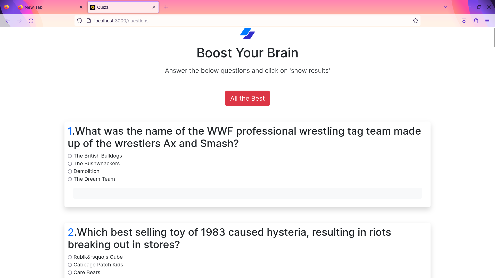
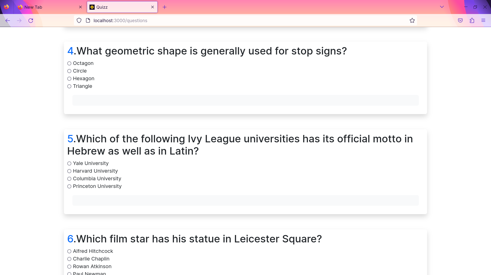
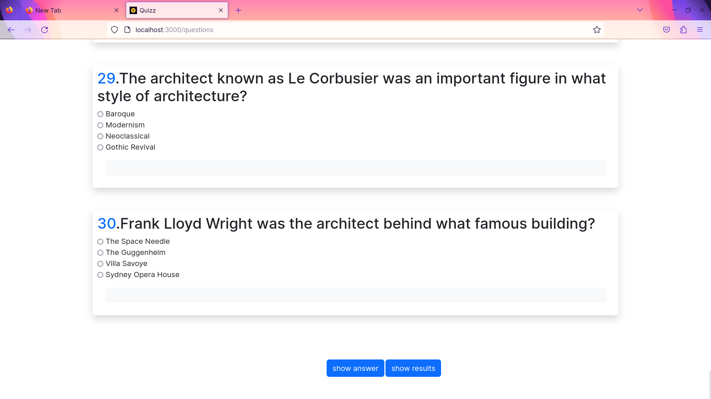
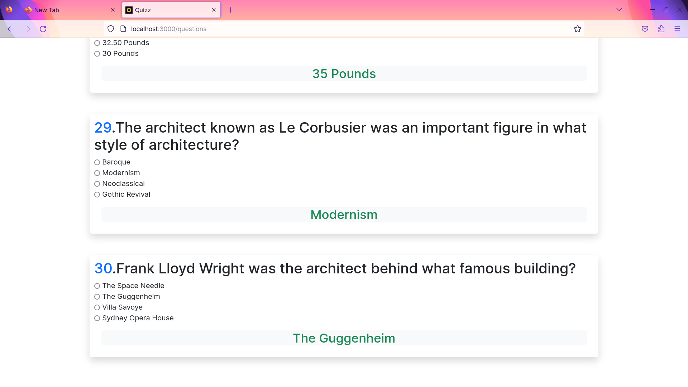
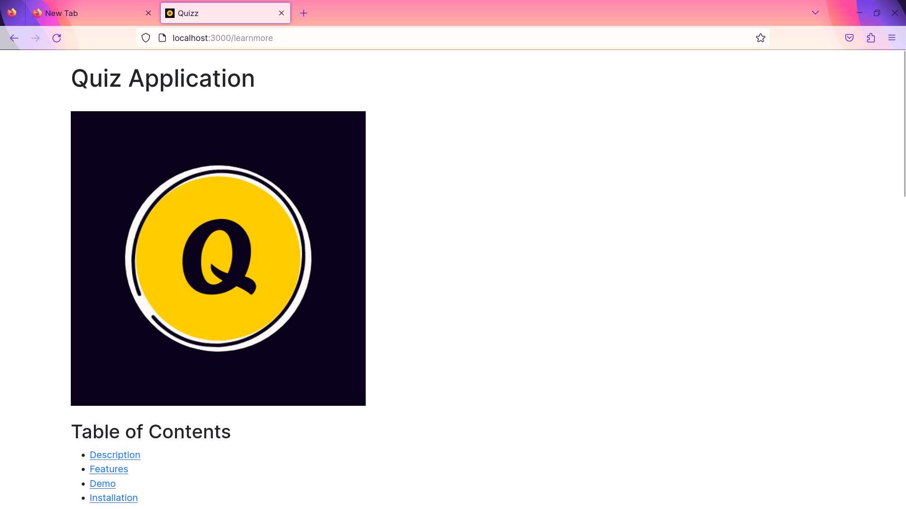
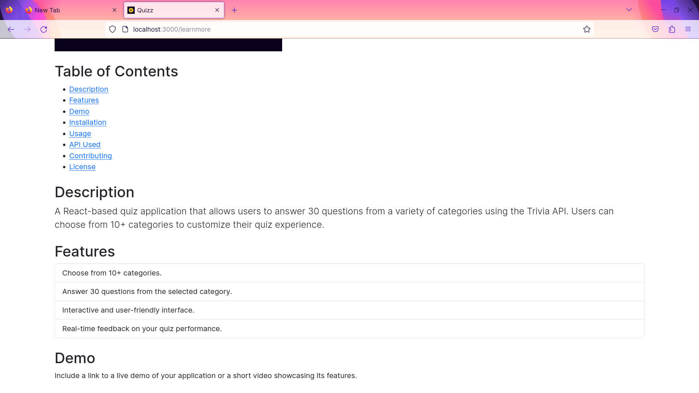

# Quiz Application

 <!-- Replace "project-image.png" with your image URL -->

## Table of Contents
- [Description](#description)
- [Features](#features)
- [Demo](#demo)
- [Installation](#installation)
- [Usage](#usage)
- [API Used](#api-used)
- [Screenshots](#screenshots)
- [Contributing](#contributing)
- [License](#license)

## Description
A React-based quiz application that allows users to answer 30 questions from a variety of categories using the Trivia API. Users can choose from 10+ categories to customize their quiz experience.

## Features
- Choose from 10+ categories.
- Answer 30 questions from the selected category.
- Interactive and user-friendly interface.
- Real-time feedback on your quiz performance.

## Demo
Include a link to a live demo of your application or a short video showcasing its features.
## screenshots

## Installation
To run this project on your local machine, follow these steps:

1. Clone the repository:
2. Change to the project directory:
3. Install dependencies: `npm install`
4. Start the development server:`npm start`

5. Open your web browser and go to [http://localhost:3000](http://localhost:3000) to access the application.

## Usage
Provide instructions and usage guidelines for your application. Explain how to use different features and interact with the quiz.

## API Used
This project uses the [Trivia API](link-to-api) to fetch quiz questions. Make sure to mention the source and provide a link to the API documentation if available.

## Contributing
If you'd like to contribute to this project, please follow these steps:

1. Fork the project on GitHub.
2. Create a new branch with a descriptive name.
3. Commit your changes.
4. Push your branch to your fork.
5. Create a pull request with a clear title and description.

## License
This project is licensed under the [MIT License](LICENSE.md).

Feel free to customize the README by adding more details and sections specific to your project. If you have any specific content you'd like to include or if you need more help with any section, please let me know!

  